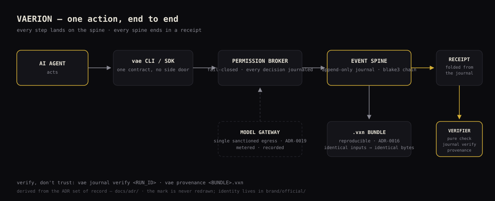

# Architecture — how one action becomes evidence

Vaerion runs AI-assisted work the way a database engine runs
transactions. Follow one action left to right:

1. **The agent acts through an entrypoint** — the `vae` CLI or the
   `@vaerion/sdk`. There is no side door: every path into the engine
   carries the same contracts.
2. **The permission broker decides.** Every step proposes a grant; the
   fail-closed broker admits, denies, or demands a human gate — and
   journals the decision either way (`receipt.counts.decisions_deny`
   exists because refusals are evidence too).
3. **Model I/O passes one sanctioned gateway** (ADR-0019) — the single
   egress point for model traffic, metered and recorded.
4. **Every step lands on the event spine** — one versioned, append-only
   journal per run, records chained with blake3. Single writer,
   checkpoint chaining, deterministic replay (ADR-0006).
5. **The receipt is folded from the journal** — run ID, trace ID, config
   fingerprint, engine version, counts, and the journal head hash. The
   receipt is not written by the run; it is *computed from the record*.
6. **Deliverables build into `.vxn` bundles** — deterministic and
   reproducible: identical inputs produce identical bytes, verified by a
   pure check that never executes content (ADR-0016).
7. **Anyone verifies without trusting** — `vae journal verify` re-walks
   the chain; `vae provenance` reads a bundle's receipt. Both are pure
   checks: they observe, they never execute.

The full decision record lives in the ADR set — start at
[`docs/adr/README.md`](../adr/README.md). The guarantees this flow
buys, and the honest limits, are in [`docs/LIMITATIONS.md`](../LIMITATIONS.md)
and [`docs/security/THREAT-MODEL.md`](../security/THREAT-MODEL.md).
